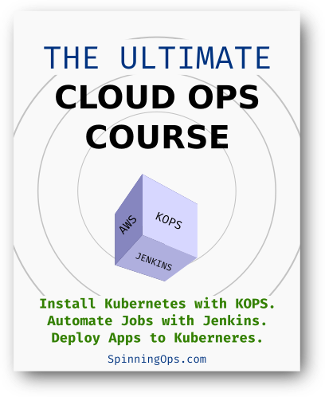

# The Ultimate CloudOps Course
### Install Kubernetes with KOPS
### Automate Jobs with Jenkins
### Deploy Apps to Kuberneres

### This course will help you install KOPS at AWS and deploy apps like WordPress and Flask to Kuberneres and Automate jobs with Jenkins installed as a pod in Kuberneres.